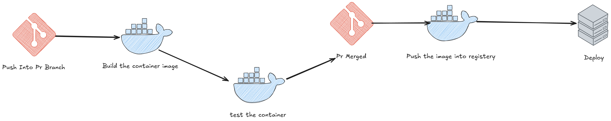

# Docker CI Automation

> Automation is the cornerstone of DevOps practices

This repository demonstrates a simple CI pipeline using Docker with a basic Express.js API application.

## Overview

This example showcases a minimalist Express.js API with health check endpoints, containerized using Docker. It serves as a practical demonstration of implementing continuous integration practices with Docker.

## Prerequisites

- Node.js (v16 or higher)
- Docker
- Git

## Getting Started

### Installation

1. Install dependencies:

```bash
npm install
```

### Running Locally

Start the server:

```bash
npm start
```

The server will be available at `http://localhost:3000`

### Environment Variables

The application supports the following environment variables:

- `PORT`: Server port (default: 3000)

## API Endpoints

### Root Endpoint

```
GET /
```

Returns a welcome message.

**Response**: Status 200

```
"this is docker automation ci pipeline examples!"
```

### Health Check

```
GET /health
```

Returns the API health status.

**Response**: Status 200

```json
{
  "status": "OK"
}
```

## Docker Support

### Building the Image

```bash
docker build -t docker-ci-demo .
```

### Running the Container

```bash
docker run -p 3000:3000 docker-ci-demo
```

## Code Example

```javascript
// src/app.js
import express from "express";

const app = express();
const serverPort = process.env.PORT || 3000;

app.use(express.json());
app.use(express.urlencoded({ extends: false }));

app.get("/", (req, res) => {
  res.status(200).send("this is docker automation ci pipeline examples!");
});

app.get("/health", (req, res) => {
  res.status(200).json({
    status: "OK",
  });
});

app.listen(3000, () => {
  console.log(`The Server is up and running on http://localhost:${serverPort}`);
});
```

## CI Docker Piplies

## 01- Basic Docker Pipeline

This project includes a GitHub Actions workflow that automates the Docker image build and push process. The pipeline is defined in `.github/workflows/basic-docker.yml`.

### Pipeline Overview



### Workflow Configuration

```yaml
name: Basic Docker Build

on:
  push:
    branches:
      - master
  pull_request:

jobs:
  build-image:
    name: Build Docker Image
    runs-on: ubuntu-latest
    steps:
      - name: Login Into Docker Hub
        uses: docker/login-action@v3
        with:
          username: ${{ secrets.DOCKERHUB_USERNAME }}
          password: ${{ secrets.DOCKERHUB_TOKEN }}
      - name: Docker Build
        uses: docker/build-push-action@v6
        with:
          push: ${{ github.event_name != 'pull_request' }}
          tags: moabdelazem/automate-docker:latest,moabdelazem/automate-docker:01
```

### Pipeline Steps Explained

1. **Trigger Conditions**:

   - Triggers on push to `master` branch
   - Triggers on any pull request

2. **Environment**:

   - Runs on Ubuntu latest version
   - Uses Docker's official GitHub Actions

3. **Authentication**:

   - Logs into Docker Hub using secure credentials
   - Uses GitHub Secrets for secure credential storage

4. **Build and Push**:
   - Builds the Docker image
   - Pushes to Docker Hub with two tags:
     - `latest`: Rolling latest version
     - `01`: Version-specific tag
   - Skips push step for pull requests

### Required Secrets

To use this pipeline, you need to configure these secrets in your GitHub repository:

- `DOCKERHUB_USERNAME`: Your Docker Hub username
- `DOCKERHUB_TOKEN`: Your Docker Hub access token

## Contributing

Contributions are welcome! Please feel free to submit a Pull Request.
